# 初始化

::: info 提示：

如不想部署，也可以在 [Demo](https://ezmusic.muyi.dev/) 环境下配置下你的后端 api 。

:::

## 更改语言

首先登录 directus。

如下图，点击左侧菜单的齿轮图标 `Setting - Project Settings`。

找到 `Default Language` 选择 `Chinese（Simplified）`，然后点击右上角的 `√` 进行保存。

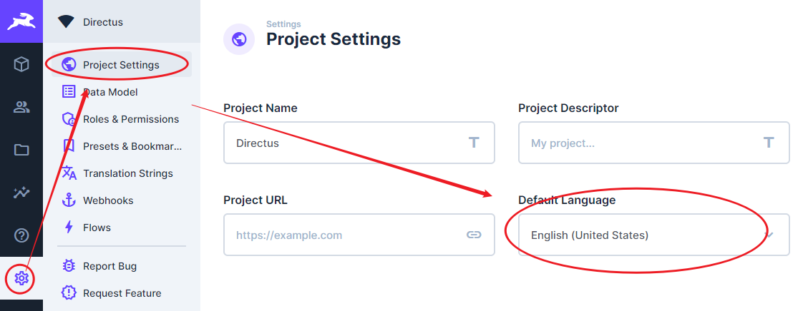

如果还有部分内容显示英文，请继续往下操作。

如下图，点击左下角图标 `Admin User - Administrator`。

找到`User Preferences - Language`，选择 `Chinese（Simplified）`，然后点击右上角的 `√` 进行保存。

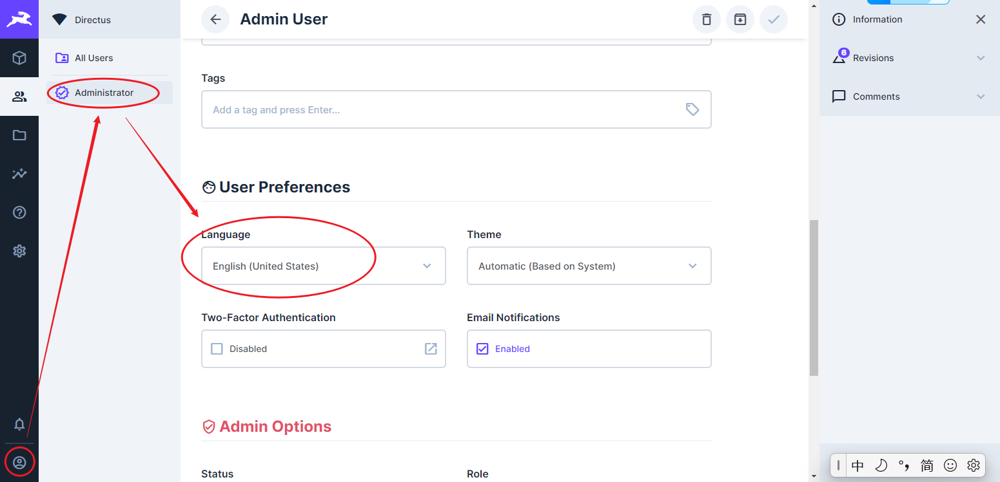

## 建表

如下图，一共会创建 4 个模型，让我们一个一个来。 

首先点击左侧的齿轮图标 - 数据模型，进入数据模型管理页面。

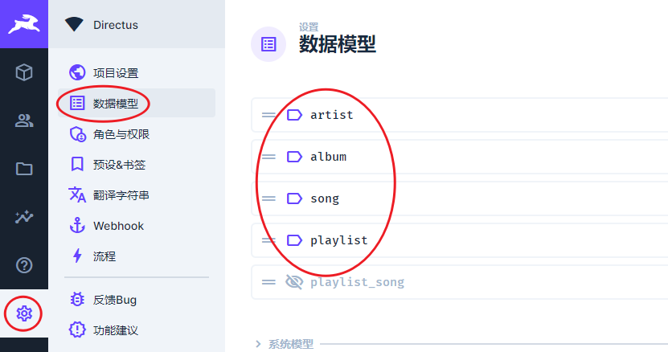

### artist 艺术家

点击右上角 `＋` 图标，开启创建流程。

如下图，名称填写 `artist`；类型选择 `生成的 UUID`；下一步。

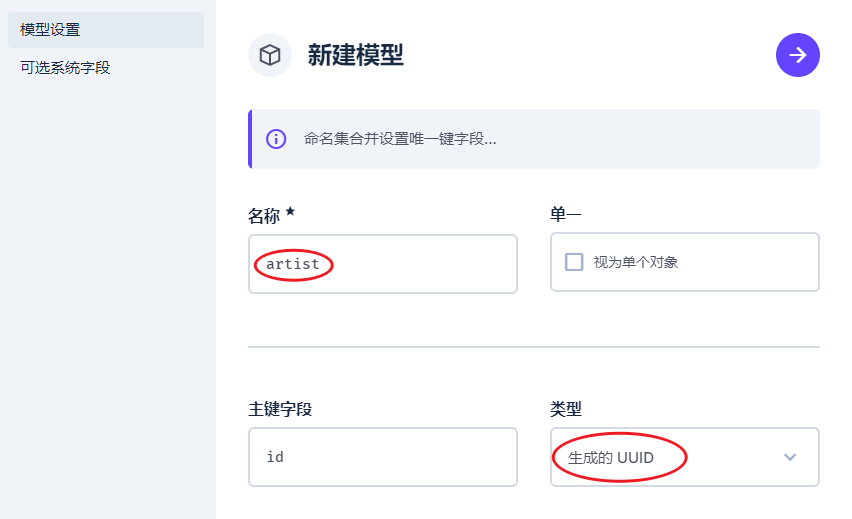

系统字段这里选择了两个：`date_created` `date_updated`。

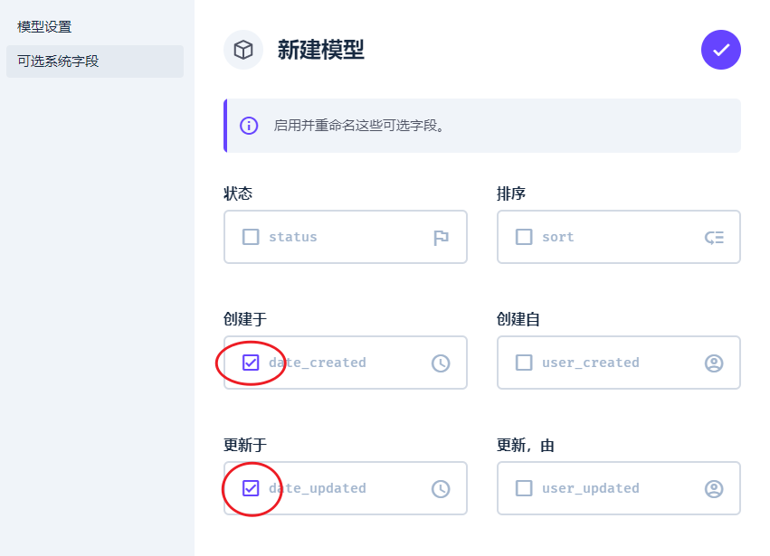

然后来创建字段

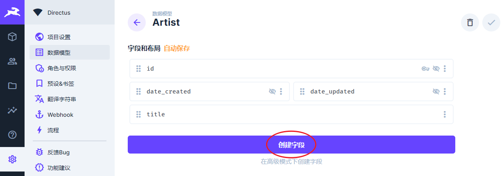

如下图，选择 input 类型，关键字填 title，点击后面的保存即可。

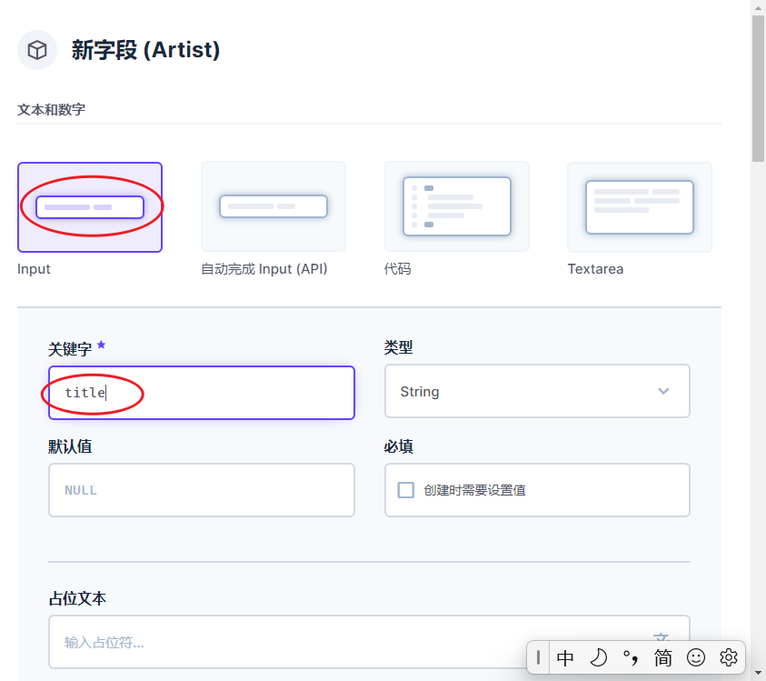

### Album 专辑

同样的方法，让我们创建 album 模型。

如下图，系统字段仍然选 `date_created` `date_updated`。

另外要创建几个字段：

- **title** 专辑名称

- **artist** 专辑艺术家

- **data_publish** 专辑发行时间

- **disk** 专辑碟片数量

- **finish** 专辑是否完整（这个字段没实际意义，可不要）

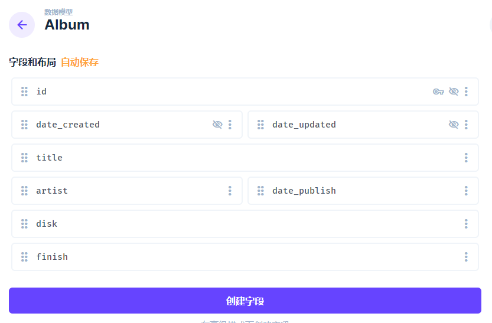

字段配置如下：

- **title** 类型选 input

- **artist** 类型选 多对一；相关模型选前面创建的 arist 模型；显示模板选 title 即可。
  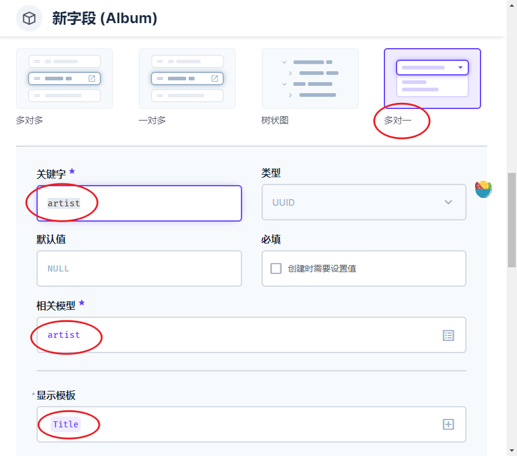

- **date_publish** 类型选择 日期时间；类型由 DateTime 改为 Date
  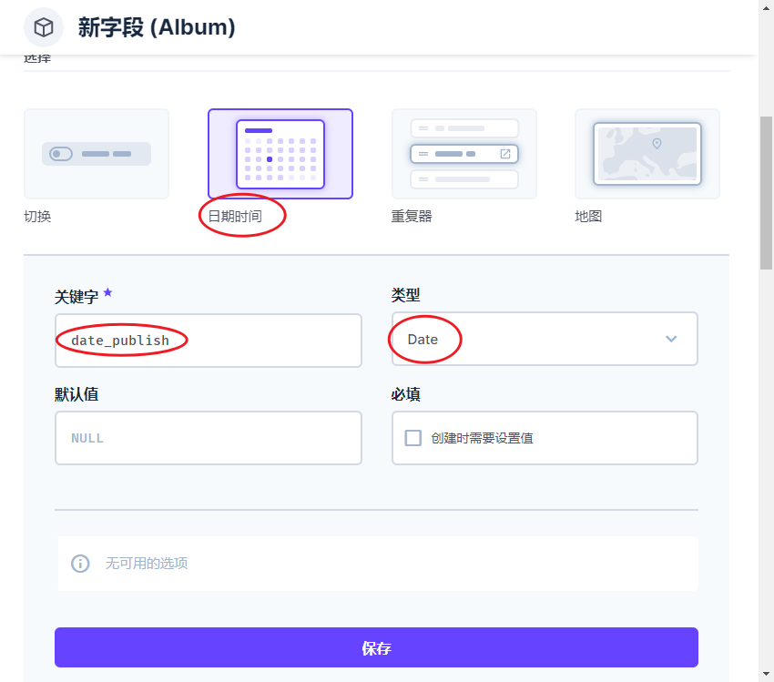

- **disk** 类型选择 input；类型由 String 改为 Integer；默认值填 1；最小值填 1
  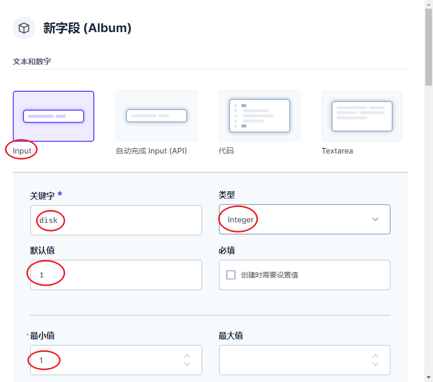

- **finish** 类型选择 切换；默认值改为不勾选
  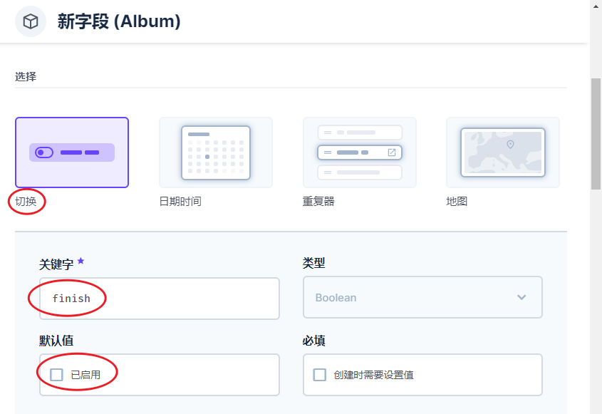

### Song 歌曲

同样的方法，让我们创建 song 模型。

如下图，系统字段仍然选 `date_created` `date_updated`。

另外要创建几个字段：

- **title** 歌曲名称 - input

- **album** 专辑名称 - 多对一 找到前面创建的 Album

- **track** 第几首歌曲 - input Integer

- **disk** 第几张碟片 - input Integer

- **file** 音频文件 - 文件

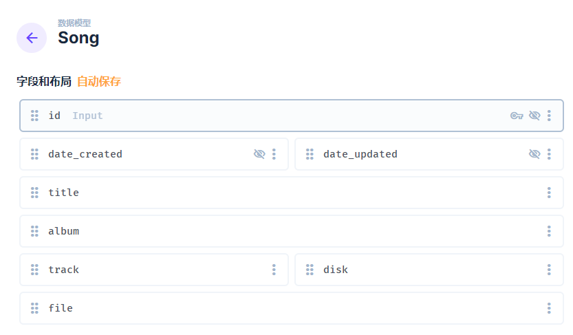

### Playlist 歌单

最后，用同样的方法创建 playlist 模型。

如下图，可以看到系统字段多了两个：`user_created` `user_updated`，是为了将来多用户考虑的，目前用不到。

另外要创建几个字段：

- **title** 歌单名称 - input

- **song_id** 歌单中所有歌曲 id 的集合

- **active** 正在播放的歌单 - 切换

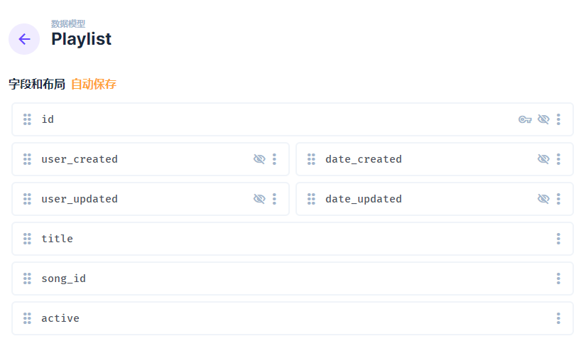

这里说一下 song_id 的创建， 其它的前面介绍过了，就不再重复了。

如下图，类型选择多对多；相关模型选择前面创建的 song 模型即可。

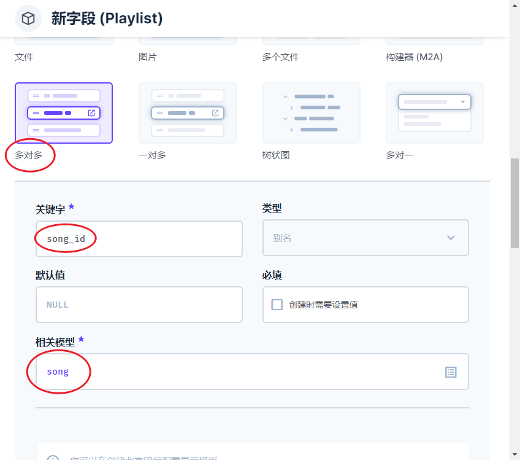

至此，数据库表就全部配好了。

## 权限配置

默认情况下，directus 的 api 是需要鉴权的，鉴于 ezMusic 目前逻辑还用不到用户体系，所以需要调整一下访问权限，让 api 可以公开访问。

注意：公开访问意味着所有数据的暴露，好在 directus 有很精准的权限控制方式。请确保你的接口不被滥用。

如下图，打开公开角色的权限配置。

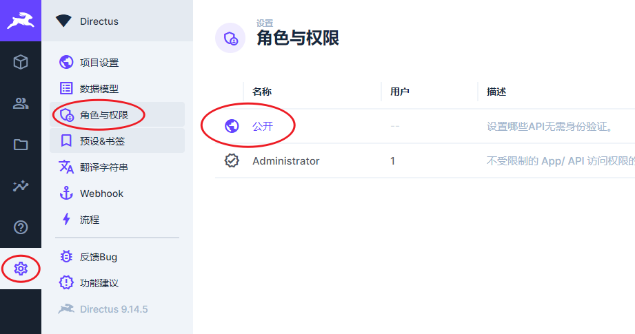

我这里简单粗暴的把查看权限全部放开了，你在用的时候可以根据实际情况调整。

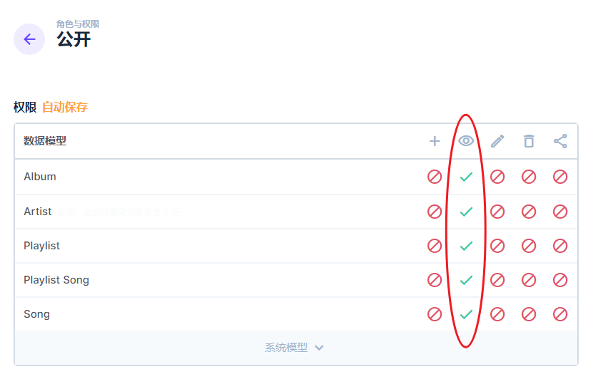

至此，所有基础工作完成。数据维护请参考[这里](./management.html)。
