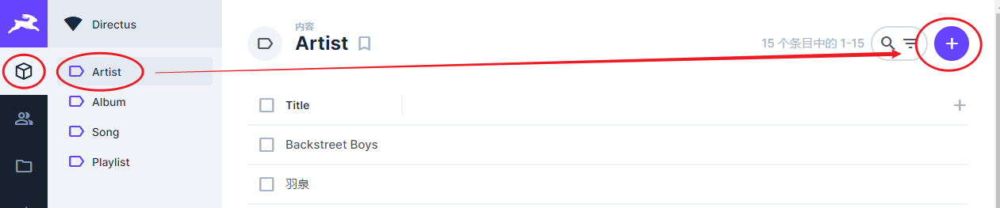
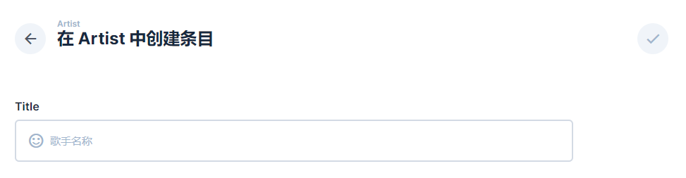
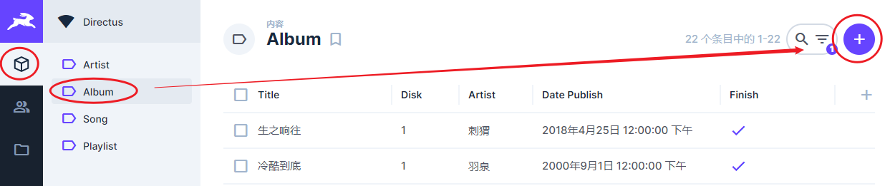
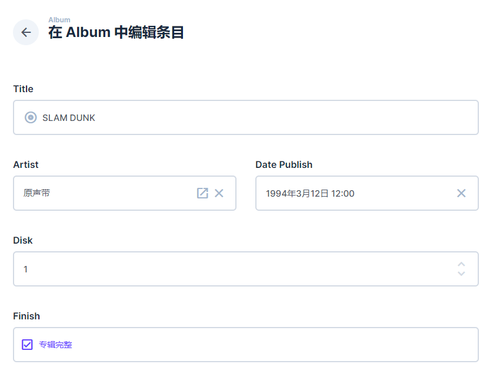
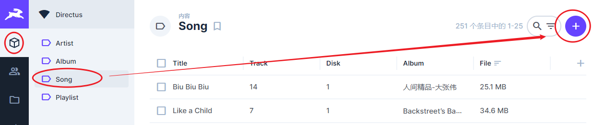
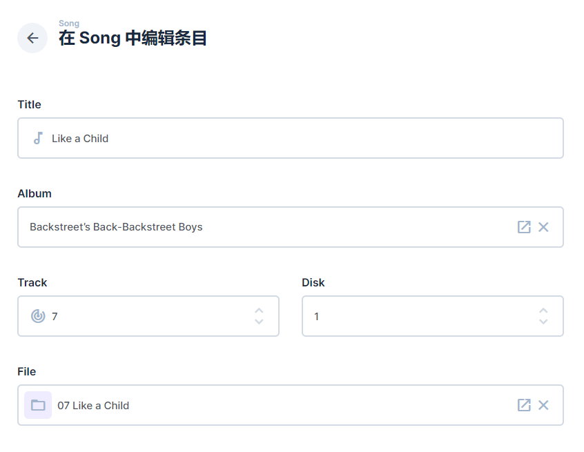

<!--
 * @Author: NMTuan
 * @Email: NMTuan@qq.com
 * @Date: 2022-09-21 11:02:50
 * @LastEditTime: 2022-09-21 11:02:57
 * @LastEditors: NMTuan
 * @Description: 
 * @FilePath: \muyi.dev\docs\ezmusic\management.md
-->

# 维护

目前没有针对数据维护单独写功能，直接使用 directus 的面板来维护数据。

## 创建艺术家

如下图，点击右上角的 `+` 添加。

在出现的表单中，填入艺术家名称，提交表单即可。

## 创建专辑

如下图，点击右上角的 `+` 添加。

填写表单项，提交即可。

 

## 添加歌曲

如下图，点击右上角的 `+` 添加。

填写表单项，提交即可。

