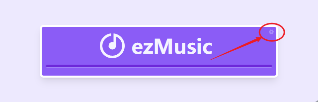
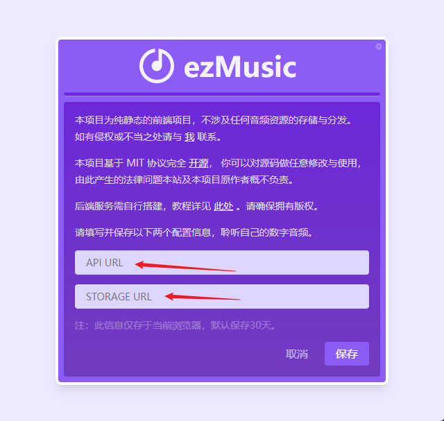

# 上手

::: warning 注意：

本项目为纯静态的前端项目，不涉及任何音频资源的存储与分发。如有侵权或不当之处请与 [我](https://github.com/NMTuan) 联系。

:::

由于不涉及音频资源的存储与分发，所以想要正常使用，需要自行搭建后端服务，详情可参考[后端部署](./backend.html)，请确保拥有音乐的合法使用权。

前端部分，你可以[自行部署](./frontend.html)，也可以在 [Demo](https://ezmusic.muyi.dev/) 环境下配置下你的后端 api 。

## 配置 api

如下图，点击右上角的 “齿轮”，打开配置页面。

在下方的表单中填入 **api 地址** 和 **对象存储的 url 前缀** 后，保存即可。

待页面自动刷新后， 点击 logo 或者 ezMusic 后，能正常播放说明配置正确。

如果能显示歌曲信息但无法播放，说明 **storage  url** 配置有误。
